<!-- hero: animated terminal svg -->
<p align="center">
  
</p>

<p align="center">
  
</p>

<!-- system snapshot -->
<p align="center">
  
</p>

```
   ┌─┐┌─┐┌─┐┌─┐                  user@system
  ┌┴─┴┴─┴┴─┴┴─┴┐                 ─────────────
  │  SARVESH   │                 os    : computer engineering
  │   SYSTEM   │                 focus : software · ai · ml · cv
  └┬─┬┬─┬┬─┬┬─┬┘                 langs : python · java · js · sql
   └─┘└─┘└─┘└─┘                 models: tensorflow · pytorch
                                  web   : react · node.js
                                  tools : git · linux
```

<!-- stack -->
<p align="center">
  
</p>

<table align="center">
  <tr>
    <th align="left">Category</th>
    <th align="left">Modules</th>
  </tr>
  <tr>
    <td><b>Languages</b></td>
    <td>
      
      
      
      
    </td>
  </tr>
  <tr>
    <td><b>ML &amp; AI</b></td>
    <td>
      
      
    </td>
  </tr>
  <tr>
    <td><b>Web &amp; Backend</b></td>
    <td>
      
      
    </td>
  </tr>
  <tr>
    <td><b>Tooling</b></td>
    <td>
      
      
    </td>
  </tr>
</table>

<!-- github -->
<p align="center">
  
</p>

<table align="center">
  <tr>
    <td align="center">
      
      
      
    </td>
  </tr>
</table>

<p align="center">
  
</p>

<!-- competitive programming -->
<p align="center">
  
</p>

<table align="center">
  <tr>
    <td align="center">
      <b>LEETCODE</b><br/>
      <a href="https://leetcode.com/u/Sarvesh0001/">Sarvesh0001</a><br/>
      
    </td>
    <td align="center">
      <b>CODEFORCES</b><br/>
      <a href="https://codeforces.com/profile/fakeSarvesh">fakeSarvesh</a><br/>
      
    </td>
  </tr>
</table>

<!-- learning -->
<p align="center">
  
</p>

<table align="center">
  <tr>
    <th align="left">Status</th>
    <th align="left">Track</th>
    <th align="left">Scope</th>
  </tr>
  <tr>
    <td></td>
    <td><b>Deep Learning</b></td>
    <td>CNNs · RNNs · Transformers</td>
  </tr>
  <tr>
    <td></td>
    <td><b>Computer Vision</b></td>
    <td>detection · segmentation · generation</td>
  </tr>
  <tr>
    <td></td>
    <td><b>Systems &amp; Backend</b></td>
    <td>design · scalability</td>
  </tr>
  <tr>
    <td></td>
    <td><b>Open Source</b></td>
    <td>contributions · tooling</td>
  </tr>
</table>

<!-- facts -->
<p align="center">
  
</p>

```
[ debug ]  I read the stack trace before the documentation.
[ info  ]  My learning is 20% tutorials and 80% debugging.
[ bench ]  I profile model latency more than I care to admit.
```

<!-- connect -->
<p align="center">
  
</p>

<p align="center">
  <a href="https://github.com/Sarveshyg"></a>
  <a href="mailto:sarvesh.freelance.work@gmail.com"></a>
</p>

<p align="center">
  
</p>

<p align="center">
  <sub>system ready — thanks for reading.</sub>
</p>
